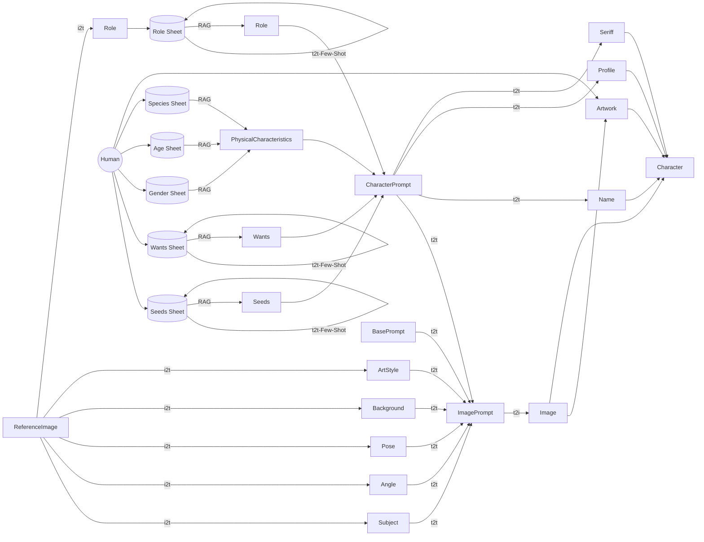

# 100 TIMES AI HEROES

- Winner of the Special Jury Award at the 3rd AI Art Grand Prix

## Concept
In this project, I broke down the thought flow and work process of character creation in my own manga production and reproduced it using generative AI, accelerating the speed of character creation.
By utilizing the capabilities of generative AI, I hope to improve the productivity of processes such as character creation, enabling me to create works that are more focused on my own artistic creativity.
However, at the same time, I also realized that even the reflection of my own artistic creativity in my work might be replaced by generative AI. If generative AI can continue to create characters and stories autonomously, humans may only be left with the role of appreciating them.
Furthermore, even the role of appreciating works may one day be a function that can be replaced by AI.
Through the exploration of creation using generative AI, we will have to reexamine the meaning, purpose, and fundamental desire of human creation.
Finalist entry for the 3rd AI Art Grand Prix

このプロジェクトでは、私自身のマンガ制作におけるキャラクター創出の思考フローと作業プロセスを分解し、生成AIを用いて再現することで、キャラクター創出のスピードを加速させました。 生成AIの能力を活かして、キャラクター創出などのプロセスの生産性を向上し、より私自身の作家性にフォーカスした作品制作を可能にすることが期待できます。 しかし一方で、作品への私自身の作家性の反映すら、生成AIに代替できてしまうのではないか？という気づきもありました。キャラクターやストーリーを、生成AIが自律的に創作し続けることができたら、人間には鑑賞する役割しか残らないかもしれません。 さらに言えば、作品を鑑賞する役割すら、いつかAIに代替されうる機能なのかもしれません。 私たちは、生成AIによる創作の探求を通じて、人間による創作の意義、目的、その根源たる欲求を見つめ直さなければならないでしょう。

第3回AIアートグランプリ審査委員特別賞受賞

## Concept page
- https://portfolio.foti.jp/100-times-ai-heroes

## Blog（日本語のみ）
- https://note.com/msfmnkns/n/naa7eaadc5054

## Gallery

### v1.2

- https://youtu.be/b0jEhHOS0PM

### v1.1

- https://youtu.be/HX0C0swU4Rc

### v1.0

- https://youtu.be/2luIVu3bXLg

---

## Local Version (Ollama + CSV)

ローカルLLM（Ollama）とローカルCSVを使用した版です。Google SheetsやクラウドAPIは、既定の実行では使用しません。

### Features

- **生成時はローカル実行**: モデル導入後は外部サービスへ接続しない
- **無料**: 既定のOllama実行ではAPI課金なし
- **プライバシー**: 既定の実行ではデータがクラウドに送信されない
- **シード自動拡張**: 生成ごとに新しい属性が追加される
- **ローカル画像生成**: ComfyUIを使って画像もローカル保存できる

### Requirements

- Python 3.9+
- [Ollama](https://ollama.com/)
- 推奨モデル: `gpt-oss:20b`（デフォルト）

### Quick Start

```bash
# 1. Ollamaインストール（macOS）
brew install ollama

# 2. モデルダウンロード（初回のみ。標準: gpt-oss:20b）
ollama pull gpt-oss:20b

# 3. 依存インストール
pip install -r requirements.txt

# 4. 環境設定
cp .env.example .env

# 5. Ollamaを起動（別ターミナル。すでに起動中なら不要）
ollama serve

# 6. 実行（10キャラクター生成）
python ollama_hero_gen.py -n 10
```

モデルを導入済みであれば、6の生成処理はネットワーク接続なしで実行できます。モデル未導入時にプログラムが自動ダウンロードすることはありません。

### Model Options

実行環境に合わせてモデルを選択できます。

| モデル | メモリ目安 | 特徴 | 選択コマンド |
|--------|-----------|------|-------------|
| `gpt-oss:20b` | 12GB | **標準・デフォルト** | （省略可） |
| `gpt-oss:20b-q4_K_M` | 約6GB | 量子化版・低メモリ環境向け | `--model gpt-oss:20b-q4_K_M` |
| `gpt-oss:120b` | 80GB+ | 高性能版・高スペックマシン向け | `--model gpt-oss:120b` |

```bash
# 量子化版を使用
ollama pull gpt-oss:20b-q4_K_M
python ollama_hero_gen.py --model gpt-oss:20b-q4_K_M

# 高性能版を使用（128GB以上のメモリを推奨）
ollama pull gpt-oss:120b
python ollama_hero_gen.py --model gpt-oss:120b
```

### Output

各実行の結果は `data/run_YYYYMMDD_HHMMSS_ffffff/` ディレクトリに保存されます。実行するたびに新しいディレクトリが作られるため、過去の結果が上書きされません。

```
data/
├── seed_*.csv                   # シードデータ（全実行で共有・自動拡張）
├── run_20260101_120000_000000/
│   └── output.csv               # 1回目の実行結果
├── run_20260101_130000_000000/
│   └── output.csv               # 2回目の実行結果
└── run_20260101_140000_000000/
    └── output.csv               # 3回目の実行結果
```

`output.csv` のカラム構成:

| Column | Description |
|--------|-------------|
| name | キャラクター名（英語） |
| profile | プロフィール（日本語） |
| catchphrase | 決め台詞（日本語） |
| image_prompt | 画像生成用プロンプト |
| concept | キャラクターコンセプト（英語） |
| age, gender, species | 身体的属性 |
| ability, wants, role | 能力・願望・役割 |
| image_path | 画像生成時のdataディレクトリからの相対パス。未生成時は空欄 |
| image_seed | 画像生成に使ったseed。未生成時は空欄 |

### Seed CSV

`data/seed_*.csv` は1列のCSVです。1行目にヘッダーを置き、2行目以降に候補を1つずつ記載します。

| File | Header |
|------|--------|
| `seed_age.csv` | `age` |
| `seed_gender.csv` | `gender` |
| `seed_species.csv` | `species` |
| `seed_ability.csv` | `ability` |
| `seed_wants.csv` | `wants` |
| `seed_role.csv` | `role` |

空行は無視されますが、有効な候補が1件もないファイルやヘッダーが違うファイルはエラーになります。

### Files

```
ollama_hero_gen.py      # メインスクリプト
data/
├── seed_*.csv          # シードデータ（自動生成・拡張、全実行で共有）
└── run_*/
    ├── output.csv      # 実行ごとの生成結果（上書きなし）
    ├── errors.jsonl    # 失敗時のみ作成
    └── images/         # --generate-images時のみ作成
```

### Local image generation

ComfyUIをlocalhostで起動し、画像生成モデルを事前に配置したうえで実行します。画像モデルはプロファイルで切り替えられます。

```bash
# .envで比較候補を選択（checkpoint名はprofileから自動設定）
COMFYUI_MODEL_PROFILE=animagine-xl-4.0-opt

python ollama_hero_gen.py --iterations 1 --generate-images
```

候補と設定は `config/comfyui/model_profiles.json` に定義しています。

| Profile | 用途 | Checkpoint |
|---|---|---|
| `animagine-xl-4.0-opt` | アニメ・JRPG系の第一候補 | `animagine-xl-4.0-opt.safetensors` |
| `illustrious-xl-v2` | 線・色を重視するイラスト | `Illustrious-XL-v2.0.safetensors` |
| `pony-v6-xl` | 獣人・異種族 | `ponyDiffusionV6XL_v6StartWithThisOne.safetensors` |
| `noobai-xl-1.1` | 実験的な品質候補 | `NoobAI-XL-v1.1.safetensors` |

モデルを1つに決める前に、同一の固定seedで候補を比較できます。既定では3ケース×2seed×4モデルを実行します。

```bash
# ComfyUIへ接続せず、profileとpromptだけ検証
python tools/benchmark_image_models.py --dry-run

# ComfyUIで実画像を比較。report.jsonと画像をdata/以下へ保存
python tools/benchmark_image_models.py

# まず2モデル、1ケース、1seedだけで確認
python tools/benchmark_image_models.py \
  --profiles animagine-xl-4.0-opt,illustrious-xl-v2 \
  --cases 1 \
  --seeds 101
```

ベンチマークはbatch size 1で実行し、macOSでは生成中の空きメモリ率も `report.json` に記録します。profileを切り替えるときは、既定でComfyUIの `/free` APIを呼び、前のモデルを解放します。

通常の生成でも、次の画像を開始する前にシステムの空きメモリ率を確認します。既定の最低空きメモリ率は15%です。128GBのApple Siliconでは、OllamaとComfyUIを同時に大量ロードせず、必要に応じて `.env` の `MINIMUM_AVAILABLE_MEMORY_PERCENT` を調整してください。

既定のworkflowは `config/comfyui/text2image_api_workflow.json` です。画像生成時も、ComfyUI以外の外部サービスには接続しません。

### Optional cloud LLM

クラウドLLMを使う場合だけ、追加依存関係をインストールしてproviderを明示します。

```bash
pip install -r requirements-cloud.txt
OPENAI_API_KEY=... python ollama_hero_gen.py --provider openai --iterations 1
```

`--provider`を省略した場合はOllamaが使われます。クラウドLLMを使う場合でも、`--generate-images`の画像生成先はlocalhostのComfyUIです。

---

## Original Code (OpenAI API)
- https://github.com/masa-jp-art/100-times-ai-heroes/blob/main/20240916-AI-Art-GP-3-Charactor-v1.0.py

## Original workflow

以下は元のColab版のワークフローです。現在のローカル版はGoogle Sheetsではなく、`data/seed_*.csv` と `data/run_*/output.csv` を使用します。

