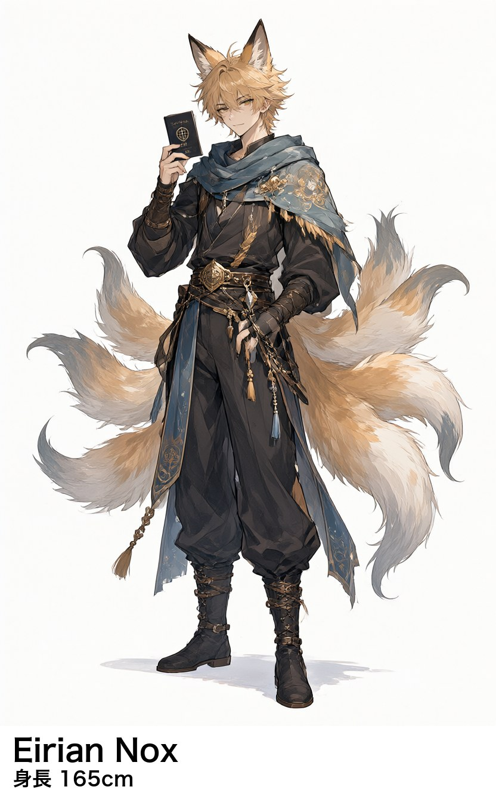
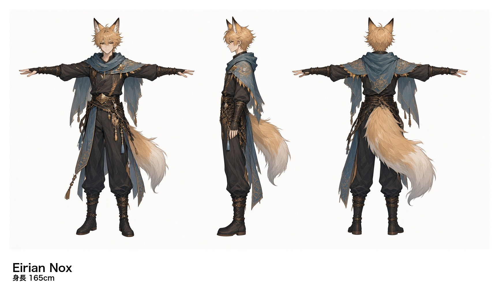
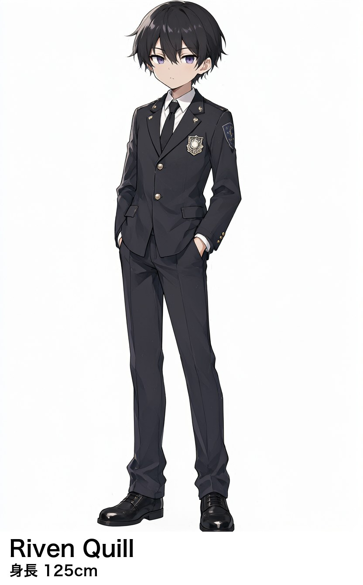
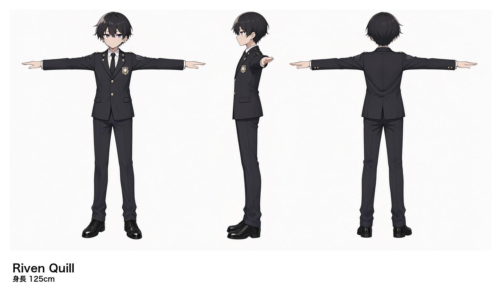
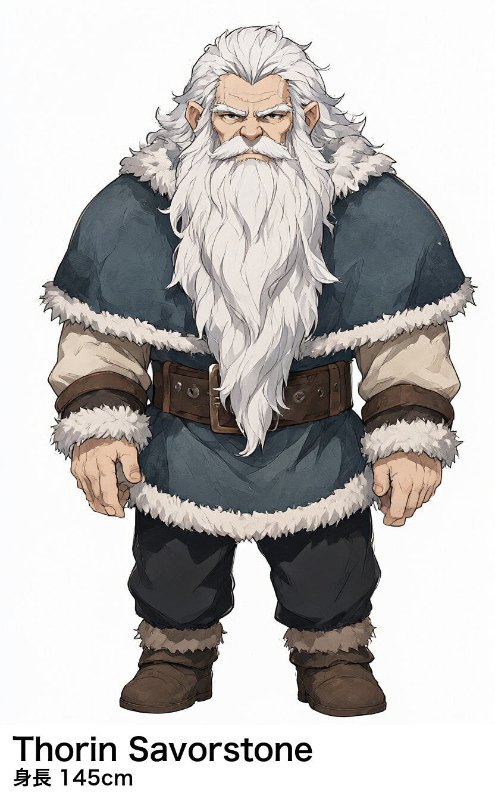
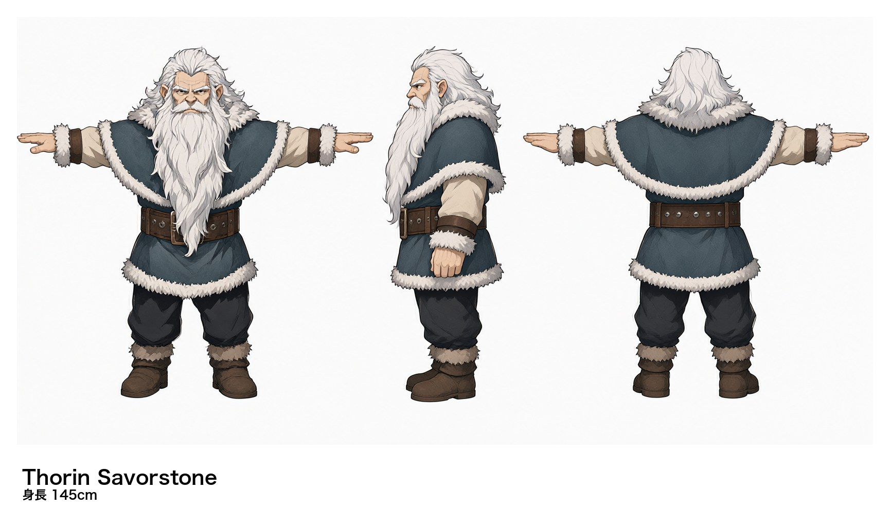
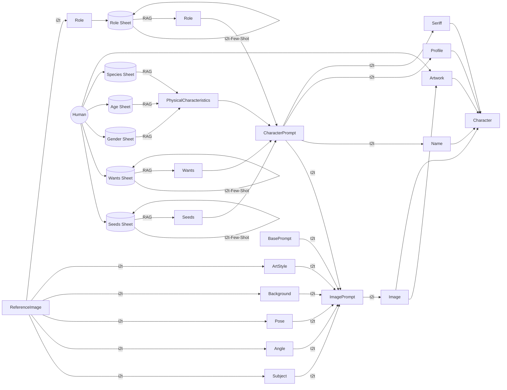

# 100 TIMES AI HEROES

- Winner of the Special Jury Award at the 3rd AI Art Grand Prix

## このリポジトリは何か

100 TIMES AI HEROESは、キャラクターの設定（名前、プロフィール、決め台詞、能力、役割）を生成し、必要に応じて全身キャラクター画像まで作るローカルAIパイプラインです。

現在の利用経路は **ローカルCSV + Ollama + ComfyUI** です。Google Sheetsは使いません。通常の実行ではクラウドAPIへ接続せず、クラウドLLMは明示的に選んだ場合だけ利用できます。

### まず動かす

初回だけインターネット接続が必要です。Ollamaモデル、ComfyUI、選択した画像モデルを導入するため、空きディスク60GB以上を推奨します（既定の画像モデル Qwen-Image 2.1 が約32GB、LLM の gpt-oss:20b が約13GB）。

```bash
git clone https://github.com/masa-san-jp/100-times-ai-heroes.git
cd 100-times-ai-heroes

python3 setup_local.py
python3 run_local.py --iterations 1 --generate-images
```

macOS/Linuxでは `bash setup_local.sh` / `bash run_local.sh` も使えます。WindowsなどでOllamaを自動導入できない環境では、先に[Ollama公式ダウンロード](https://ollama.com/download)から導入してください。

Windowsでは `python3` を `python` または `py` に読み替えてください。

生成結果は `data/run_日時/` に保存されます。既定のローカル経路では、導入完了後の生成にネットワーク接続は不要です。

### 利用経路

| 目的 | コマンド | 外部サービス |
|---|---|---|
| テキストだけ | `python3 run_local.py --iterations 1` | Ollama（localhost） |
| テキスト + 画像 | `python3 run_local.py --iterations 1 --generate-images` | Ollama + ComfyUI（localhost） |
| OpenAIでテキスト生成 | `python3 run_local.py --provider openai --iterations 1` | OpenAI API（明示指定時のみ） |
| 画像モデル比較 | `python3 tools/benchmark_image_models.py` | ComfyUI（localhost） |

画像モデル比較の設計と背景は [Issue #10](https://github.com/masa-san-jp/100-times-ai-heroes/issues/10) を参照してください。

`setup_local.py` は導入用、`run_local.py` はサービス起動と実行用、`ollama_hero_gen.py` は生成パイプライン本体です。
OpenAI経路を使う場合は、先に `python3 setup_local.py --skip-ollama --skip-images --with-cloud` を実行して追加依存関係を導入し、`OPENAI_API_KEY`を設定してください。

## 出力サンプル

既定の設定（LLM: `gpt-oss:20b`、画像: Qwen-Image 2.1 + Viggle turbo）で、2026-09-27 に生成した3体です。seed CSV からランダムに選ばれた属性（年齢・性別・種族・役割・能力・願望）をもとに、LLM が名前・プロフィール・決め台詞・身長を作ります。そのうえで、全身像と、全身像を参照画像にした T ポーズの3面図（正面・側面・背面）を生成します。画像の下の名前と身長は、プログラムで描き入れています。プロフィールと決め台詞は、生成されたものをそのまま載せています。

1体を生成すると、次のフォルダができます（M4 Max で1体あたり約10分）。

```
data/run_日時/characters/001_Eirian_Nox/
├── character.json    # 全データ（属性、プロフィール、身長、画像の生成条件と seed）
├── character.md      # 画像入りの設定資料
├── full_body.png     # 全身像（名前・身長入り）
├── turnaround.png    # 3面図（名前・身長入り）
└── raw/              # 帯なしの元画像
```

ここに載せている画像は、容量を抑えるために JPEG に変換したものです。各キャラクターの `character.json` は [examples/characters/](examples/characters/) にあります。

### Eirian Nox（身長 165cm）

| 全身像 | 3面図 |
|---|---|
|  |  |

- 年齢・性別・種族: Late teens（十代後半）/ Genderfluid（ジェンダーフルイド）/ Nine-tailed fox apprentice（九尾の狐の見習い）
- 役割: Border Guard of the Dream Country（夢の国の国境警備員。夢に入る眠る人のパスポートを検査する）
- 能力: Can erase their presence from cameras and screens（カメラや画面から自分の存在を消せる）
- 願望: I want to find a friend who is not afraid of my power.（自分の力を恐れない友人を見つけたい）
- プロフィール: 彼は十代後半のジェンダーフルード九尾の狐の見習いで、夢国の国境警備員として働く。夢に入る眠人のパスポートをチェックし、カメラや画面から彼らの存在を消し去る能力を持ち、目に見えないまま国境の整合性を保つ。彼は自分の力を恐れない友人を探している。
- 決め台詞: 私は、夢の国の境界を巡る九尾の狐であり、誰もが私の姿を消す力を恐れずに受け入れられる仲間を探し出す。

### Riven Quill（身長 125cm）

| 全身像 | 3面図 |
|---|---|
|  |  |

- 年齢・性別・種族: Prepubescent（思春期前）/ Agender（アジェンダー）/ Minor demon on probation（保護観察中の小悪魔）
- 役割: Mirror Customs Officer（鏡の税関職員。鏡像のあいだを行き来するものをすべて検査する）
- 能力: Can reverse gravity for everyone who laughs（笑った人全員の重力を反転させられる）
- 願望: I want to prove I am not the villain the prophecy described.（自分が予言に書かれた悪役ではないと証明したい）
- プロフィール: 彼は未熟年齢の非バイナリーの小悪魔で、ミラー通関官として反射を超えるすべてのものを検査する。彼の能力は、笑う者全員に重力を逆転させることで、喜びの波がしきい値を超えた瞬間に発動する。彼は、予言で描かれた悪役ではないことを証明し、鏡の沈黙に宿る仮定に挑むことを願っている。
- 決め台詞: 私は、鏡の境界を歩き、笑いの音で重力を逆転させ、プロフェシーに描かれた悪の像を揺るがす証明になるんだ。

### Thorin Savorstone（身長 145cm）

| 全身像 | 3面図 |
|---|---|
|  |  |

- 年齢・性別・種族: Frozen at nineteen for two hundred years（19歳のまま200年凍結されている）/ Male（男性）/ Dwarf（ドワーフ）
- 役割: Taste Translator（味覚翻訳者。味を音楽に変換し、味を感じられない人に届ける）
- 能力: Can hear the thoughts of animals as poetry（動物の考えを詩として聞き取れる）
- 願望: I want to design a memory that everyone in the city can share without fighting.（街の誰もが争わずに共有できる記憶をデザインしたい）
- プロフィール: 彼は19歳で凍結されて200年が経過した男性ドワーフで、役割はTaste Translator（味覚翻訳者）です。味を音楽に変換し、味覚を持たない人々へ届けることができ、動物の思考を詩として聴き取る能力も備えています。願望は、都市のすべての人々が争いなく共有できる記憶を設計することです。
- 決め台詞: 私は、氷に閉じ込められた二百年の若き矮人として、味覚を失った者に音楽を奏で、動物の心音を詩に変えて、争いのない共鳴する記憶を街に刻むよ。

### このサンプルでわかる課題

- 3面図の造形は全身像とよく一致するが、九尾の尻尾が1本になるなど、複雑な特徴は崩れることがある
- 「保護観察中の小悪魔」「19歳のまま凍結」のような意外性のある設定は、絵に表れにくい
- ローカル LLM の日本語訳に誤りが出ることがある（Agender を「非バイナリー」と訳すなど）

画像は Qwen-Image 2.1（Qwen Research License、研究・評価目的）で生成したもので、MIT License の対象外です（[License and model terms](#license-and-model-terms)）。

## 関連リポジトリ

100 TIMES AIシリーズの制作工程を、キャラクター・物語・世界観・マンガ作画に分けて扱う兄弟リポジトリです。

- [100-times-ai-heroes](https://github.com/masa-san-jp/100-times-ai-heroes) — 本リポジトリ。キャラクター設定と、必要に応じた全身キャラクター画像を生成します。
- [100-times-ai-heros-journey](https://github.com/masa-san-jp/100-times-ai-heros-journey) — ヒーローズ・ジャーニーの物語構造に沿って、物語やプロットを自動生成します。リポジトリ名は `heros` 表記です。
- [100-times-ai-world-building](https://github.com/masa-san-jp/100-times-ai-world-building) — AIを活用した世界観構築ワークフローを、Jupyter Notebookで体験できます。
- [100-times-ai-manga-drawing](https://github.com/masa-san-jp/100-times-ai-manga-drawing) — 生成AIを活用したマンガ作画ワークフローの実験・制作を扱います。

## Concept
In this project, I broke down the thought flow and work process of character creation in my own manga production and reproduced it using generative AI, accelerating the speed of character creation.
By utilizing the capabilities of generative AI, I hope to improve the productivity of processes such as character creation, enabling me to create works that are more focused on my own artistic creativity.
However, at the same time, I also realized that even the reflection of my own artistic creativity in my work might be replaced by generative AI. If generative AI can continue to create characters and stories autonomously, humans may only be left with the role of appreciating them.
Furthermore, even the role of appreciating works may one day be a function that can be replaced by AI.
Through the exploration of creation using generative AI, we will have to reexamine the meaning, purpose, and fundamental desire of human creation.
Finalist entry for the 3rd AI Art Grand Prix

このプロジェクトでは、私自身のマンガ制作におけるキャラクター創出の思考フローと作業プロセスを分解し、生成AIを用いて再現することで、キャラクター創出のスピードを加速させました。 生成AIの能力を活かして、キャラクター創出などのプロセスの生産性を向上し、より私自身の作家性にフォーカスした作品制作を可能にすることが期待できます。 しかし一方で、作品への私自身の作家性の反映すら、生成AIに代替できてしまうのではないか？という気づきもありました。キャラクターやストーリーを、生成AIが自律的に創作し続けることができたら、人間には鑑賞する役割しか残らないかもしれません。 さらに言えば、作品を鑑賞する役割すら、いつかAIに代替されうる機能なのかもしれません。 私たちは、生成AIによる創作の探求を通じて、人間による創作の意義、目的、その根源たる欲求を見つめ直さなければならないでしょう。

第3回AIアートグランプリ審査委員特別賞受賞

## Concept page
- https://portfolio.foti.jp/100-times-ai-heroes

## Blog（日本語のみ）
- https://note.com/msfmnkns/n/naa7eaadc5054

## Gallery

### v1.2

- https://youtu.be/b0jEhHOS0PM

### v1.1

- https://youtu.be/HX0C0swU4Rc

### v1.0

- https://youtu.be/2luIVu3bXLg

---

## Local Version (Ollama + CSV)

ローカルLLM（Ollama）とローカルCSVを使用した版です。Google SheetsやクラウドAPIは、既定の実行では使用しません。

### Features

- **生成時はローカル実行**: モデル導入後は外部サービスへ接続しない
- **API料金不要**: 既定のローカル実行ではクラウドAPI課金なし（ハードウェア・電気代は別）
- **プライバシー**: 既定の実行ではデータがクラウドに送信されない
- **シード自動拡張**: 生成ごとに新しい属性が追加される
- **ローカル画像生成**: ComfyUIを使って画像もローカル保存できる

### Requirements

- Python 3.10+（テキスト生成だけを手動構成する場合は3.9+）
- [Ollama](https://ollama.com/)
- Git
- 画像生成まで使う場合: ComfyUIを動かせる環境と、モデル保存用の空き容量
- 推奨LLMモデル: `gpt-oss:20b`（デフォルト）

### Quick Start（ローカル版を全部導入）

```bash
# 初回だけ。Ollama、プロジェクト用Python環境、ComfyUI、
# デフォルト画像モデル Qwen-Image 2.1（約32GB）を導入する
# 導入前にライセンス（研究・評価目的のみ）の確認を求めます
python3 setup_local.py

# 以降は、サービスを自動起動して1キャラクター生成
python3 run_local.py --iterations 1 --generate-images
```

macOS/Linuxでは同じ処理を `bash setup_local.sh` / `bash run_local.sh` として実行できます。

初回セットアップでは次の処理を行います。

- Ollamaの確認（macOSでHomebrewがある場合はインストールを提案）
- `gpt-oss:20b` の導入
- プロジェクト用の `.venv` 作成と依存関係の導入
- `.runtime/ComfyUI` へのComfyUI導入
- `.runtime/ComfyUI/models/checkpoints/` への選択モデル導入
- モデルのSHA256検証と `.env` の作成

LLMモデルと画像モデルは大容量のため、導入前に確認を表示します。確認を省略する場合は次を使います。

```bash
python3 setup_local.py --yes
```

画像生成を使わず、テキスト生成だけ導入する場合:

```bash
python3 setup_local.py --skip-images
python3 run_local.py --iterations 1
```

導入予定だけ確認する場合:

```bash
python3 setup_local.py --dry-run
```

`setup_local.sh` はランタイムをリポジトリ内の `.runtime/` に隔離します。既存のComfyUIを使いたい場合は、導入先を指定できます。

```bash
python3 setup_local.py --comfyui-dir /path/to/ComfyUI
```

ComfyUIは動作を確認したリリース（現在は `v0.37.4`）に固定して導入します。別のリリースを試す場合は `COMFYUI_REF=v0.x.y` を指定してください。既存のComfyUIが固定リリースと異なる場合は、切り替え方を警告で表示します。

`--comfyui-dir` に既定の `.runtime/ComfyUI` 以外を指定すると、ComfyUI用の仮想環境もその親ディレクトリの `comfyui-venv` に作成されます。仮想環境の場所は `COMFYUI_VENV` または `--comfyui-venv` で明示指定できます。

```bash
python3 setup_local.py --comfyui-dir /path/to/ComfyUI --comfyui-venv /path/to/comfyui-venv
```

使用する画像モデルを変更する場合は、profileを1つだけ指定します。候補を全て自動取得することはありません。既定は Qwen-Image 2.1 turbo（Viggleの6ステップLoRA）で、M4 Maxでは1枚約2.5〜3分です。turboは第三者のComfyUI拡張を使用し、拡張コードはコミット固定のURLから取得してSHA256を検証します。25ステップ版を使う場合は `qwen-image-2.1` を指定してください。速さを優先する場合や、商用利用する場合は Animagine XL 4.0（1枚約2分、約7GB）も選べます。

```bash
python3 setup_local.py --profile qwen-image-2.1
# 25ステップ版（品質の参照用）
# .env の COMFYUI_MODEL_PROFILE も qwen-image-2.1 に書き換わる

python3 setup_local.py --profile animagine-xl-4.0-opt
# .env の COMFYUI_MODEL_PROFILE も animagine-xl-4.0-opt に書き換わる
```

セットアップ後は、`run_local.py`（macOS/Linuxでは`run_local.sh`）が必要なOllamaとComfyUIをlocalhost限定で起動します。ログは `.runtime/ollama.log` と `.runtime/comfyui.log` に保存されます。

### Manual / text-only setup

自動セットアップを使わず、従来どおり手動で導入する場合:

```bash
# Ollamaインストール（macOS）
brew install ollama

# モデルダウンロード（初回のみ。標準: gpt-oss:20b）
ollama pull gpt-oss:20b

# 依存インストール
pip install -r requirements.txt

# 環境設定
cp .env.example .env

# Ollamaを起動（別ターミナル。すでに起動中なら不要）
ollama serve

# 実行（10キャラクター生成）
python ollama_hero_gen.py -n 10
```

モデルを導入済みであれば、6の生成処理はネットワーク接続なしで実行できます。モデル未導入時にプログラムが自動ダウンロードすることはありません。

### Model Options

実行環境に合わせてモデルを選択できます。

| モデル | メモリ目安 | 特徴 | 選択コマンド |
|--------|-----------|------|-------------|
| `gpt-oss:20b` | 12GB | **標準・デフォルト** | （省略可） |
| `gpt-oss:20b-q4_K_M` | 約6GB | 量子化版・低メモリ環境向け | `--model gpt-oss:20b-q4_K_M` |
| `gpt-oss:120b` | 80GB+ | 高性能版・高スペックマシン向け | `--model gpt-oss:120b` |

```bash
# 量子化版を使用
ollama pull gpt-oss:20b-q4_K_M
python ollama_hero_gen.py --model gpt-oss:20b-q4_K_M

# 高性能版を使用（128GB以上のメモリを推奨）
ollama pull gpt-oss:120b
python ollama_hero_gen.py --model gpt-oss:120b
```

### Output

各実行の結果は `data/run_YYYYMMDD_HHMMSS_ffffff/` ディレクトリに保存されます。実行するたびに新しいディレクトリが作られるため、過去の結果が上書きされません。

```
data/
├── seed_*.csv                   # シードデータ（全実行で共有・自動拡張）
├── run_20260101_120000_000000/
│   ├── output.csv               # 全キャラクターの索引
│   └── characters/              # キャラクターごとの完結した出力
├── run_20260101_130000_000000/
│   ├── output.csv
│   └── characters/
└── run_20260101_140000_000000/
    ├── output.csv
    └── characters/
```

`output.csv` のカラム構成:

| Column | Description |
|--------|-------------|
| name | キャラクター名（英語） |
| profile | プロフィール（日本語） |
| catchphrase | 決め台詞（日本語） |
| image_prompt | 画像生成用プロンプト |
| concept | キャラクターコンセプト（英語） |
| age, gender, species | 身体的属性 |
| ability, wants, role | 能力・願望・役割 |
| image_path | 名前・身長入り全身像のrunディレクトリからの相対パス。未生成時は空欄 |
| image_seed | 全身像の画像生成に使ったseed。未生成時は空欄 |
| turnaround_path | 名前・身長入り3面図のrunディレクトリからの相対パス。未生成時は空欄 |
| height_cm | キャラクターの身長（cm） |
| character_dir | キャラクター資料（`character.json`、`character.md`、画像）のrunディレクトリからの相対パス |

各キャラクターは `characters/NNN_<safe-name>/` に保存されます。フォルダには
`character.json`（全設定と生成条件）、`character.md`（日本語の設定資料）があり、
画像生成を有効にした場合は、帯付きの `full_body.png` と `turnaround.png`、
帯なしの元画像を `raw/full_body.png` と `raw/turnaround.png` に保存します。
`image_path`、`turnaround_path`、`character_dir` はこの実行ディレクトリからの相対パスです。

画像生成を有効にすると、全身像まで約4.5分、3面図に約4〜5分、1体あたり合計約9分が目安です。
100体では約15時間かかります。3面図が不要な場合は `--no-turnaround`、または
`GENERATE_TURNAROUND=false` を指定できます。

### Seed CSV

`data/seed_*.csv` は1列のCSVです。1行目にヘッダーを置き、2行目以降に候補を1つずつ記載します。

`data/seed_*.csv` がない場合は、同梱の `config/seeds/seed_*.csv` をコピーして使います（役割・能力・願望は各約100件、種族50件）。元作品の「デジタル栄養コンサルタント」「リズミカルな動きで因果を逆転させる」のような、具体的で意外な組み合わせを手本にしています。候補を変えたい場合は `config/seeds/` を編集し、`data/seed_*.csv` を削除すると次回の実行で反映されます。

| File | Header |
|------|--------|
| `seed_age.csv` | `age` |
| `seed_gender.csv` | `gender` |
| `seed_species.csv` | `species` |
| `seed_ability.csv` | `ability` |
| `seed_wants.csv` | `wants` |
| `seed_role.csv` | `role` |

空行は無視されますが、有効な候補が1件もないファイルやヘッダーが違うファイルはエラーになります。

### Files

```
ollama_hero_gen.py      # メインスクリプト
data/
├── seed_*.csv          # シードデータ（自動生成・拡張、全実行で共有）
└── run_*/
    ├── output.csv      # 実行ごとの索引（上書きなし）
    ├── errors.jsonl    # 失敗時のみ作成
    └── characters/     # キャラクターごとの設定資料・画像
        └── NNN_<safe-name>/
            ├── character.json
            ├── character.md
            ├── full_body.png
            ├── turnaround.png
            └── raw/
                ├── full_body.png
                └── turnaround.png
```

選別した画像作例は `examples/` に保存します。モデル比較作例の生成方法は [examples/README.md](examples/README.md) を参照してください。

### Local image generation

`setup_local.py` を実行済みなら、ComfyUIの手動起動やモデル配置は不要です。次のコマンドでOllamaとComfyUIを起動し、画像まで生成します。

```bash
python3 run_local.py --iterations 1 --generate-images
```

手動構成または既存のComfyUIを使う場合は、ComfyUIを `http://127.0.0.1:8188` で起動し、checkpointを `models/checkpoints/` に配置してください。`.env` の `COMFYUI_MODEL_PROFILE` でprofileを指定できます。

候補と設定は `config/comfyui/model_profiles.json` に定義しています。

| Profile | 用途 | Checkpoint |
|---|---|---|
| `qwen-image-2.1-turbo`（既定） | Viggle 6ステップLoRA。研究・評価目的のみ。1枚約2.5〜3分 | diffusion model / text encoder / VAE / LoRA（約33GB）＋SHA256固定のComfyUI拡張 |
| `qwen-image-2.1` | 25ステップ。画質と設定の参照用。研究・評価目的のみ。1枚約9分 | diffusion model / text encoder / VAE（約32GB） |
| `animagine-xl-4.0-opt` | 高速な代替（1枚約2分）。商用利用可 | `animagine-xl-4.0-opt.safetensors` |
| `illustrious-xl-v2` | 線・色を重視するイラスト | `Illustrious-XL-v2.0.safetensors` |
| `pony-v6-xl` | 獣人・異種族 | `ponyDiffusionV6XL_v6StartWithThisOne.safetensors` |
| `noobai-xl-1.1` | 実験的な品質候補 | `NoobAI-XL-v1.1.safetensors` |

既定の画像モデルは Viggle 6ステップLoRAを組み合わせた Qwen-Image 2.1 turbo です。[Qwen Research License Agreement](https://huggingface.co/Qwen/Qwen-Image-2.1/blob/main/LICENSE)により、利用目的は研究・評価に限られ、商用利用には別途契約が必要です（詳細は下の「License and model terms」）。turboは3つのQwenモデルファイル、LoRA、コミットとSHA256を固定した第三者ComfyUI拡張を導入します。25ステップの参照版は `qwen-image-2.1` で選択できます。

2026-09-27に5モデルを比較した記録（指示文、プロンプト、画像、資料画像）は [examples/model-comparison/](examples/model-comparison/README.md) にあります。

モデルを1つに決める前に、同一の固定seedで候補を比較できます。既定では3ケース×2seed×5モデルを実行します。

```bash
# ComfyUIへ接続せず、profileとpromptだけ検証
python tools/benchmark_image_models.py --dry-run

# ComfyUIで実画像を比較。report.jsonと画像をdata/以下へ保存
python tools/benchmark_image_models.py

# まず2モデル、1ケース、1seedだけで確認
python tools/benchmark_image_models.py \
  --profiles animagine-xl-4.0-opt,illustrious-xl-v2 \
  --cases 1 \
  --seeds 101
```

ベンチマークはbatch size 1で実行し、macOSでは生成中の空きメモリ率も `report.json` に記録します。profileを切り替えるときは、既定でComfyUIの `/free` APIを呼び、前のモデルを解放します。

通常の生成でも、次の画像を開始する前にシステムの空きメモリ率を確認します。既定の最低空きメモリ率は15%です。128GBのApple Siliconでは、OllamaとComfyUIを同時に大量ロードせず、必要に応じて `.env` の `MINIMUM_AVAILABLE_MEMORY_PERCENT` を調整してください。

既定のworkflowは `config/comfyui/text2image_api_workflow.json` です。画像生成時も、ComfyUI以外の外部サービスには接続しません。

### Troubleshooting

- `Ollamaが見つかりません`: macOSでは `brew install ollama`、その他の環境では[公式ダウンロード](https://ollama.com/download)を実行してから、セットアップを再実行します。
- `ComfyUIが未導入です`: `python3 setup_local.py` を完了してから `run_local.py` を実行します。
- `checkpointが見つからない`: 使用するprofileで `python3 setup_local.py --profile <profile>` を実行します。
- 起動後に接続できない: `.runtime/ollama.log` または `.runtime/comfyui.log` を確認します。ComfyUIは `127.0.0.1:8188` のみで待ち受けます。
- メモリ不足: `.env` の `MINIMUM_AVAILABLE_MEMORY_PERCENT` を上げ、`--iterations 1` で確認します。複数モデルの同時ロードは行いません。

### Optional cloud LLM

クラウドLLMを使う場合だけ、追加依存関係を導入してproviderを明示します。画像生成を併用する場合も、画像はlocalhostのComfyUIで生成されます。

```bash
# テキストだけ。画像も使う場合は --skip-images を外す
python3 setup_local.py --skip-ollama --skip-images --with-cloud
OPENAI_API_KEY=... python3 run_local.py --provider openai --iterations 1
```

`--provider`を省略した場合はOllamaが使われます。クラウドLLMを使う場合でも、`--generate-images`の画像生成先はlocalhostのComfyUIです。

### 開発者向け: テストの実行

リポジトリルートで次のコマンドを実行すると、依存関係の準備、構文チェック、テストをまとめて実行できます。

```bash
bash tools/ci.sh
```

このコマンドはGitHub Actionsだけでなく、GitHub以外のCIやローカル環境でも同じように動作します。

### License and model terms

このリポジトリのソースコードは [MIT License](LICENSE) で提供します。

READMEに掲載している作品画像と動画、コンセプトの文章、および `examples/` に置く生成画像はMIT Licenseの対象外です。これらの権利は作者に帰属します。利用したい場合は作者に確認してください。

画像モデルはリポジトリに含めず、セットアップ時に選択したモデルの取得元からダウンロードします。モデルごとにライセンスと利用制限が異なります。原典へのリンクと要点は [docs/MODEL_LICENSES.md](docs/MODEL_LICENSES.md) にまとめています。導入時にも、選んだモデルのライセンス名と原典の URL を表示します。

#### Qwen-Image 2.1 のライセンス

Qwen-Image 2.1（profile `qwen-image-2.1`）は、[Qwen Research License Agreement（2026-09-20）](https://huggingface.co/Qwen/Qwen-Image-2.1/blob/main/LICENSE)で提供されています。Apache 2.0 などの一般的なオープンソースライセンスではありません。原文の主な条項は次のとおりです。

- 第1条 i: 「Non-Commercial」は「研究または評価の目的に限る」と定義される
- 第2条 a: 使用、複製、改変などは非商用目的に限って許諾される
- 第2条 b: 商用目的で使う場合は、別途商用ライセンスが必要（model-business@notice.qwencloud.com）
- 第3条 c: モデルを再配布する場合は、所定の著作権表示を含む Notice ファイルを添付する
- 第4条 b: モデルや生成物を使って AI モデルを作り公開する場合は、「Built with Qwen」または「Improved using Qwen」と表示する

生成した画像の使い道を直接制限する条項はありません。ただし、モデルを使う目的そのものが研究・評価に限られます。このリポジトリは生成物を販売せず、生成 AI による創作の探求としてキャラクターのアイデアを出す用途で Qwen-Image 2.1 turbo を既定モデルにしています（作者の判断）。生成物を商用に使う場合や、用途が研究・評価に当たらない場合は、Animagine XL 4.0 など商用利用可能なモデルに切り替えるか、Qwen の商用ライセンスを取得してください。`examples/model-comparison/` にある Qwen-Image 2.1 の画像は、この比較評価で生成したものです。

この節は原文の要約で、法的な助言ではありません。利用前に必ず原文を確認してください。

---

## Original Code (OpenAI API, reference only)

以下は旧版のコードです。現在の利用入口は `setup_local.py` / `run_local.py` であり、旧版を実行するための手順ではありません。

- https://github.com/masa-jp-art/100-times-ai-heroes/blob/main/20240916-AI-Art-GP-3-Charactor-v1.0.py

## Original workflow (reference only)

以下は元のColab版のワークフローです。現在のローカル版ではGoogle Sheetsを使わず、`data/seed_*.csv` と `data/run_*/output.csv` を使用します。

```mermaid
flowchart LR
	Human((Human)) --> SeedsSheet[(Seeds Sheet)]
	SeedsSheet --> |t2t-Few-Shot| SeedsSheet
	Human --> WantsSheet[(Wants Sheet)]
	WantsSheet --> |t2t-Few-Shot| WantsSheet
	Human --> GenderSheet[(Gender Sheet)]
	Human --> AgeSheet[(Age Sheet)]
	Human --> SpeciesSheet[(Species Sheet)]
	ReferenceImage -->|i2t| Subject
	ReferenceImage -->|i2t| Angle
	ReferenceImage -->|i2t| Pose
	ReferenceImage -->|i2t| Background
	ReferenceImage -->|i2t| ArtStyle
	ReferenceImage -->|i2t| 1[Role]
	1 --> RoleSheet[(Role Sheet)]
	RoleSheet --> |t2t-Few-Shot| RoleSheet
	GenderSheet -->|RAG| PhysicalCharacteristics
	AgeSheet -->|RAG| PhysicalCharacteristics
	SpeciesSheet -->|RAG| PhysicalCharacteristics
	SeedsSheet -->|RAG| Seeds
	WantsSheet -->|RAG| Wants
	RoleSheet -->|RAG| Role
	BasePrompt -->|t2t| ImagePrompt
	Seeds --> CharacterPrompt
	Wants -->CharacterPrompt
	Role --> CharacterPrompt
	PhysicalCharacteristics --> CharacterPrompt
	CharacterPrompt -->|t2t| ImagePrompt
	Subject -->|t2t| ImagePrompt
	Angle -->|t2t| ImagePrompt
	Pose -->|t2t| ImagePrompt
	Background -->|t2t| ImagePrompt
	ArtStyle -->|t2t| ImagePrompt
	ImagePrompt -->|t2i| Image
	CharacterPrompt -->|t2t| Name
  CharacterPrompt -->|t2t| Profile
	CharacterPrompt -->|t2t| Seriff
	Image --> Artwork
	Human --> Artwork
	Artwork --> Character
	Image --> Character
	Name --> Character
	Profile --> Character
	Seriff --> Character
```
