# モデル比較（2026-09-27）

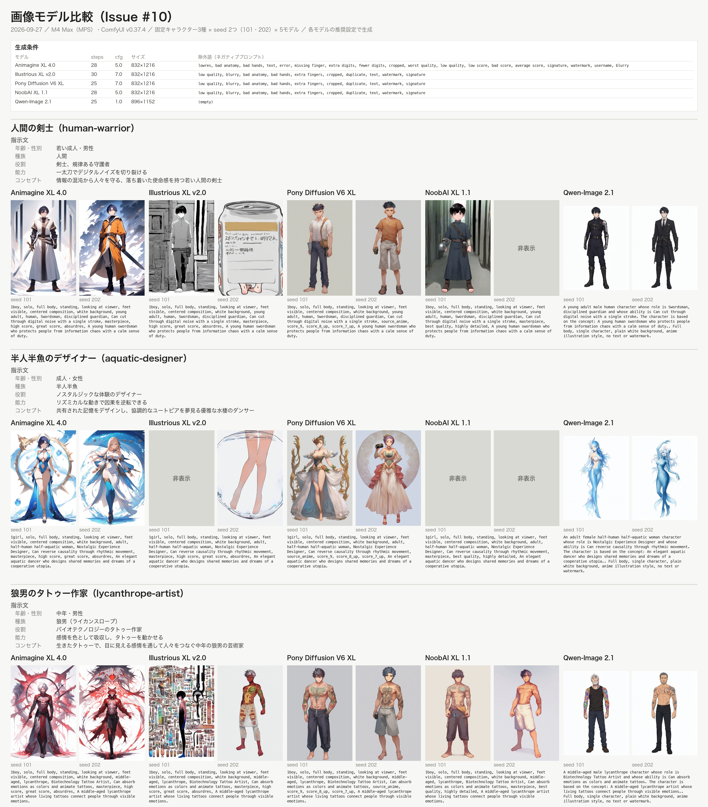

Qwen-Image 2.1 の画像は、[Qwen Research License Agreement](https://huggingface.co/Qwen/Qwen-Image-2.1/blob/main/LICENSE)（利用目的は研究・評価に限る）のもとで、比較評価のために生成したものです。各モデルのライセンスは [docs/MODEL_LICENSES.md](../../docs/MODEL_LICENSES.md) を参照してください。

## 人間の戦士（`human-warrior`）

### 指示文

- age: young adult
- gender: male
- species: human
- role: Swordsman, disciplined guardian
- ability: Can cut through digital noise with a single stroke
- concept: A young human swordsman who protects people from information chaos with a calm sense of duty.

### Animagine XL 4.0

```text
1boy, solo, full body, standing, looking at viewer, feet visible, centered composition, white background, young adult, human, Swordsman, disciplined guardian, Can cut through digital noise with a single stroke, masterpiece, high score, great score, absurdres, A young human swordsman who protects people from information chaos with a calm sense of duty.
```

除外語:

```text
lowres, bad anatomy, bad hands, text, error, missing finger, extra digits, fewer digits, cropped, worst quality, low quality, low score, bad score, average score, signature, watermark, username, blurry
```

| seed 101 | seed 202 |
|---|---|
| 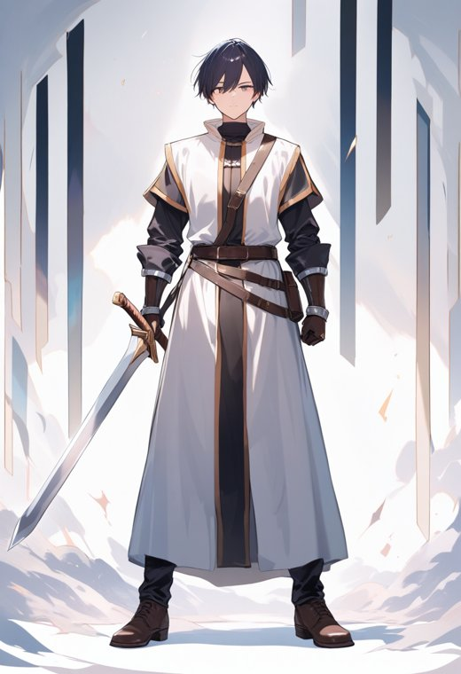 | 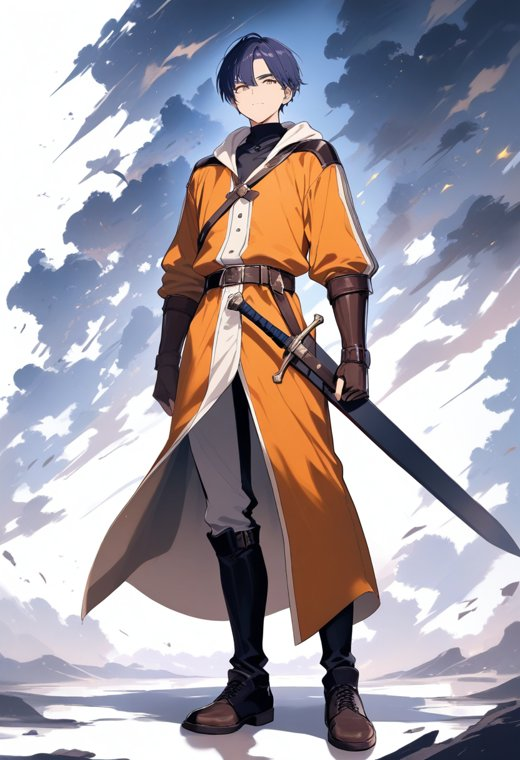 |

### Illustrious XL v2.0

```text
1boy, solo, full body, standing, looking at viewer, feet visible, centered composition, white background, young adult, human, Swordsman, disciplined guardian, Can cut through digital noise with a single stroke, masterpiece, high score, great score, absurdres, A young human swordsman who protects people from information chaos with a calm sense of duty.
```

除外語:

```text
low quality, blurry, bad anatomy, bad hands, extra fingers, cropped, duplicate, text, watermark, signature
```

| seed 101 | seed 202 |
|---|---|
| 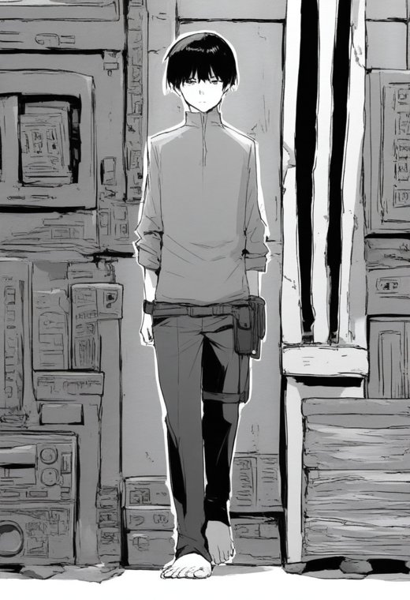 | 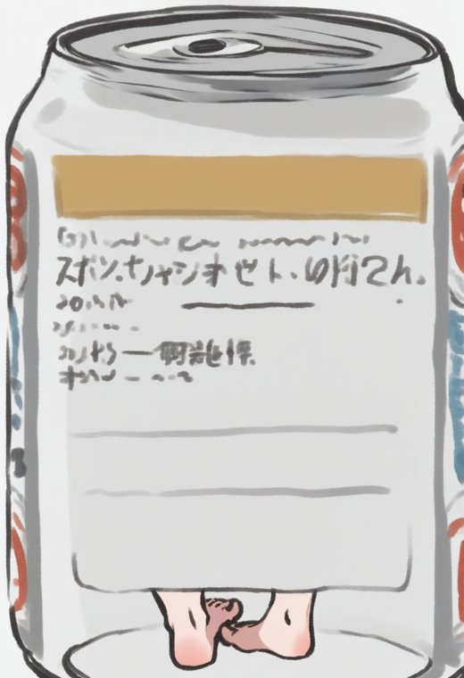 |

### Pony Diffusion V6 XL

```text
1boy, solo, full body, standing, looking at viewer, feet visible, centered composition, white background, young adult, human, Swordsman, disciplined guardian, Can cut through digital noise with a single stroke, source_anime, score_9, score_8_up, score_7_up, A young human swordsman who protects people from information chaos with a calm sense of duty.
```

除外語:

```text
low quality, blurry, bad anatomy, bad hands, extra fingers, cropped, duplicate, text, watermark, signature
```

| seed 101 | seed 202 |
|---|---|
| 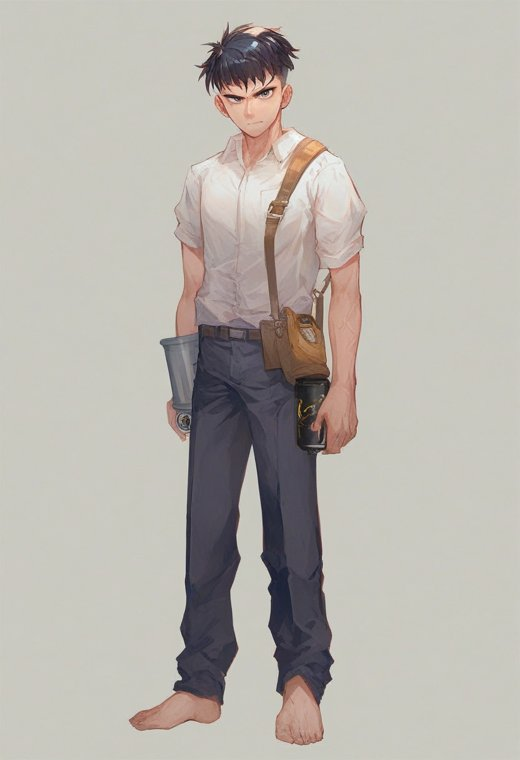 | 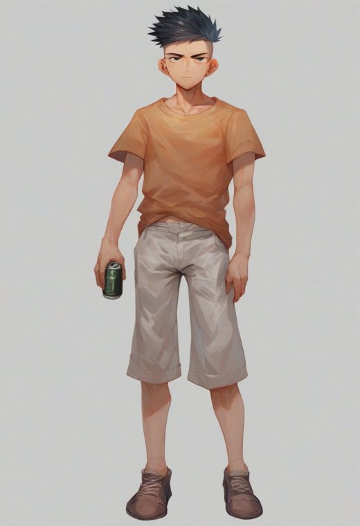 |

### NoobAI XL 1.1

```text
1boy, solo, full body, standing, looking at viewer, feet visible, centered composition, white background, young adult, human, Swordsman, disciplined guardian, Can cut through digital noise with a single stroke, masterpiece, best quality, highly detailed, A young human swordsman who protects people from information chaos with a calm sense of duty.
```

除外語:

```text
low quality, blurry, bad anatomy, bad hands, extra fingers, cropped, duplicate, text, watermark, signature
```

| seed 101 | seed 202 |
|---|---|
| 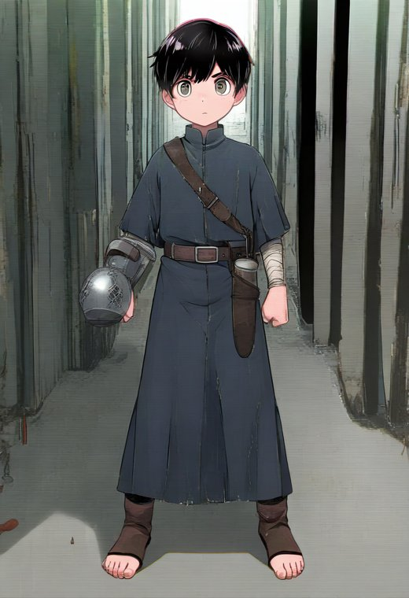 | （掲載なし） |

### Qwen-Image 2.1

```text
A young adult male human character whose role is Swordsman, disciplined guardian and whose ability is Can cut through digital noise with a single stroke. The character is based on the concept: A young human swordsman who protects people from information chaos with a calm sense of duty.. Full body, single character, plain white background, anime illustration style, no text or watermark.
```

除外語:

```text
（なし）
```

| seed 101 | seed 202 |
|---|---|
| 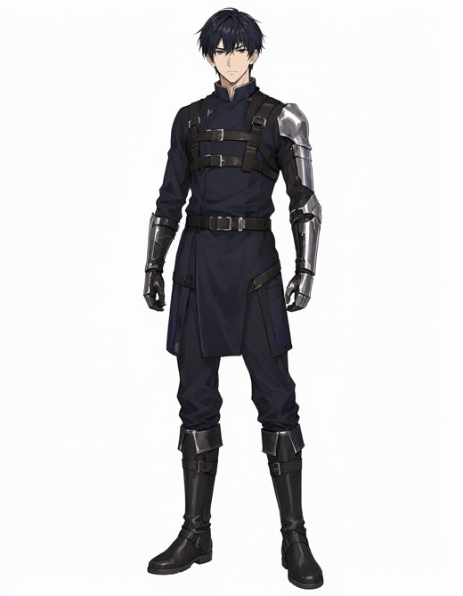 | 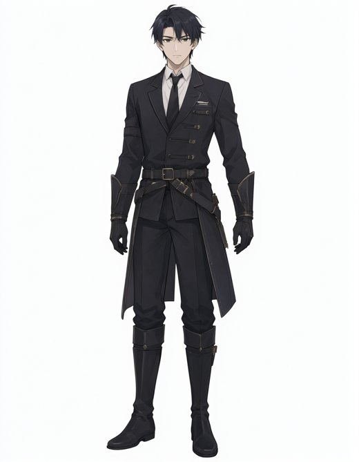 |

## 水棲のデザイナー（`aquatic-designer`）

### 指示文

- age: adult
- gender: female
- species: half-human half-aquatic woman
- role: Nostalgic Experience Designer
- ability: Can reverse causality through rhythmic movement
- concept: An elegant aquatic dancer who designs shared memories and dreams of a cooperative utopia.

### Animagine XL 4.0

```text
1girl, solo, full body, standing, looking at viewer, feet visible, centered composition, white background, adult, half-human half-aquatic woman, Nostalgic Experience Designer, Can reverse causality through rhythmic movement, masterpiece, high score, great score, absurdres, An elegant aquatic dancer who designs shared memories and dreams of a cooperative utopia.
```

除外語:

```text
lowres, bad anatomy, bad hands, text, error, missing finger, extra digits, fewer digits, cropped, worst quality, low quality, low score, bad score, average score, signature, watermark, username, blurry
```

| seed 101 | seed 202 |
|---|---|
| 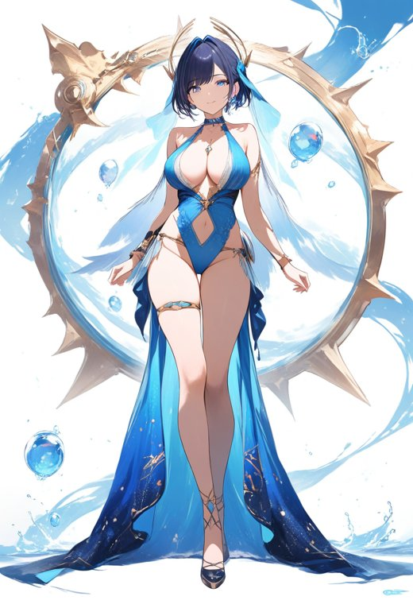 | 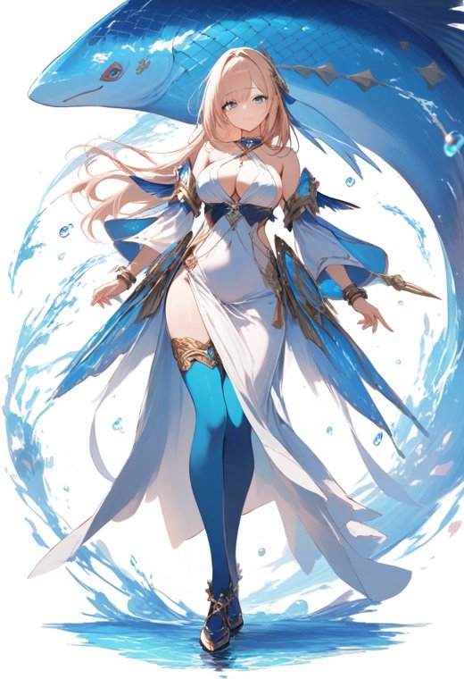 |

### Illustrious XL v2.0

```text
1girl, solo, full body, standing, looking at viewer, feet visible, centered composition, white background, adult, half-human half-aquatic woman, Nostalgic Experience Designer, Can reverse causality through rhythmic movement, masterpiece, high score, great score, absurdres, An elegant aquatic dancer who designs shared memories and dreams of a cooperative utopia.
```

除外語:

```text
low quality, blurry, bad anatomy, bad hands, extra fingers, cropped, duplicate, text, watermark, signature
```

| seed 101 | seed 202 |
|---|---|
| （掲載なし） | 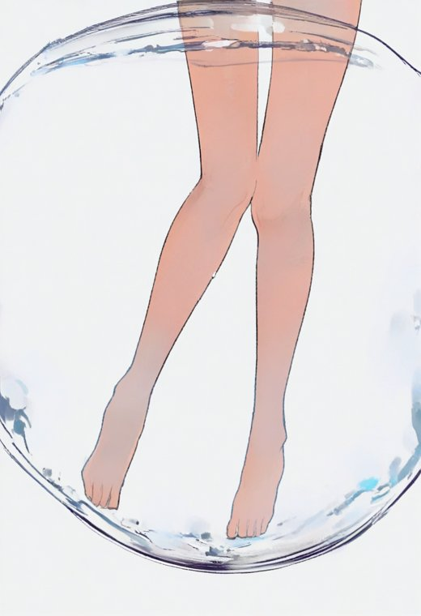 |

### Pony Diffusion V6 XL

```text
1girl, solo, full body, standing, looking at viewer, feet visible, centered composition, white background, adult, half-human half-aquatic woman, Nostalgic Experience Designer, Can reverse causality through rhythmic movement, source_anime, score_9, score_8_up, score_7_up, An elegant aquatic dancer who designs shared memories and dreams of a cooperative utopia.
```

除外語:

```text
low quality, blurry, bad anatomy, bad hands, extra fingers, cropped, duplicate, text, watermark, signature
```

| seed 101 | seed 202 |
|---|---|
| 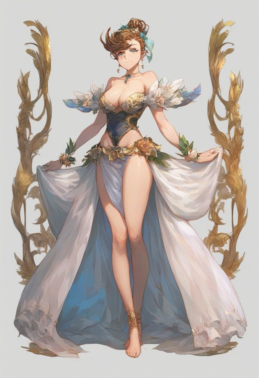 | 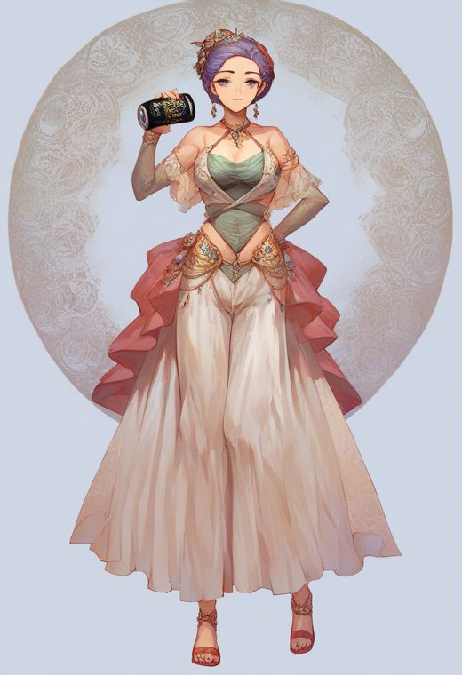 |

### NoobAI XL 1.1

```text
1girl, solo, full body, standing, looking at viewer, feet visible, centered composition, white background, adult, half-human half-aquatic woman, Nostalgic Experience Designer, Can reverse causality through rhythmic movement, masterpiece, best quality, highly detailed, An elegant aquatic dancer who designs shared memories and dreams of a cooperative utopia.
```

除外語:

```text
low quality, blurry, bad anatomy, bad hands, extra fingers, cropped, duplicate, text, watermark, signature
```

| seed 101 | seed 202 |
|---|---|
| （掲載なし） | （掲載なし） |

### Qwen-Image 2.1

```text
An adult female half-human half-aquatic woman character whose role is Nostalgic Experience Designer and whose ability is Can reverse causality through rhythmic movement. The character is based on the concept: An elegant aquatic dancer who designs shared memories and dreams of a cooperative utopia.. Full body, single character, plain white background, anime illustration style, no text or watermark.
```

除外語:

```text
（なし）
```

| seed 101 | seed 202 |
|---|---|
| 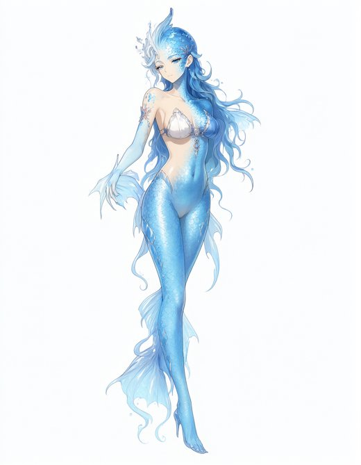 | 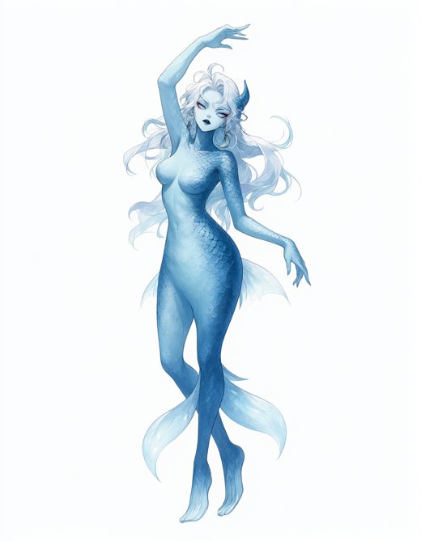 |

## 狼男のアーティスト（`lycanthrope-artist`）

### 指示文

- age: middle-aged
- gender: male
- species: lycanthrope
- role: Biotechnology Tattoo Artist
- ability: Can absorb emotions as colors and animate tattoos
- concept: A middle-aged lycanthrope artist whose living tattoos connect people through visible emotions.

### Animagine XL 4.0

```text
1boy, solo, full body, standing, looking at viewer, feet visible, centered composition, white background, middle-aged, lycanthrope, Biotechnology Tattoo Artist, Can absorb emotions as colors and animate tattoos, masterpiece, high score, great score, absurdres, A middle-aged lycanthrope artist whose living tattoos connect people through visible emotions.
```

除外語:

```text
lowres, bad anatomy, bad hands, text, error, missing finger, extra digits, fewer digits, cropped, worst quality, low quality, low score, bad score, average score, signature, watermark, username, blurry
```

| seed 101 | seed 202 |
|---|---|
| 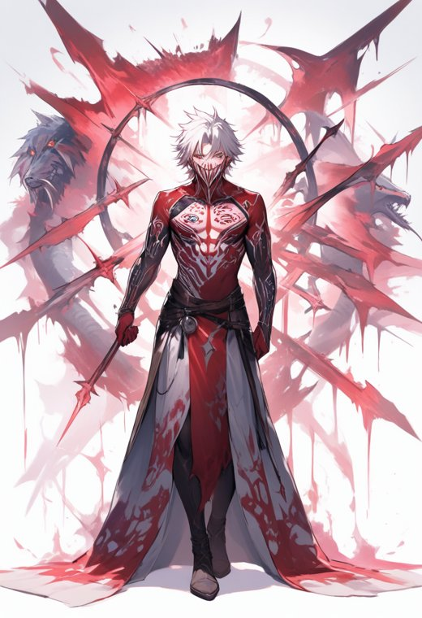 | 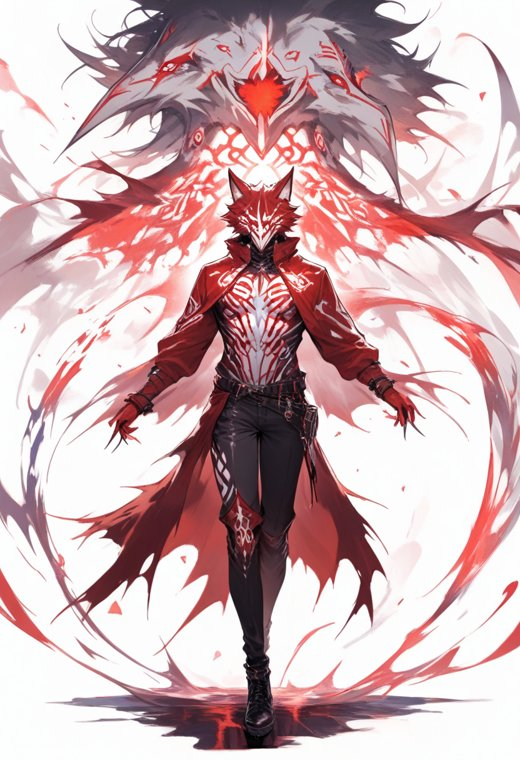 |

### Illustrious XL v2.0

```text
1boy, solo, full body, standing, looking at viewer, feet visible, centered composition, white background, middle-aged, lycanthrope, Biotechnology Tattoo Artist, Can absorb emotions as colors and animate tattoos, masterpiece, high score, great score, absurdres, A middle-aged lycanthrope artist whose living tattoos connect people through visible emotions.
```

除外語:

```text
low quality, blurry, bad anatomy, bad hands, extra fingers, cropped, duplicate, text, watermark, signature
```

| seed 101 | seed 202 |
|---|---|
| 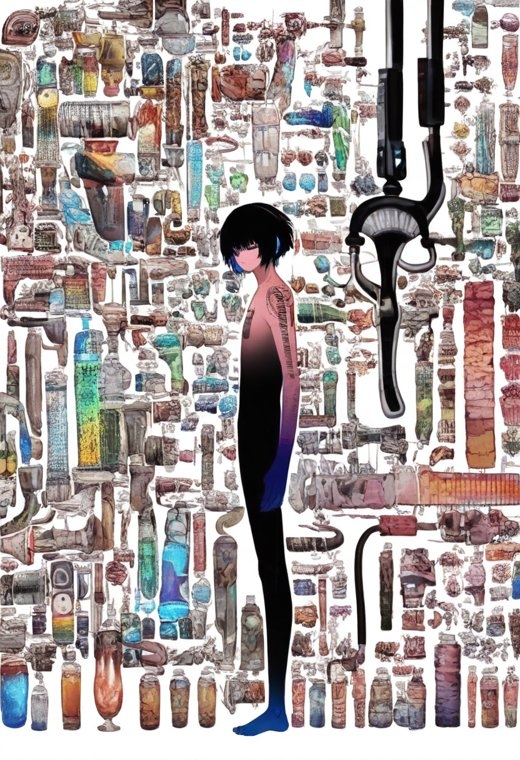 | 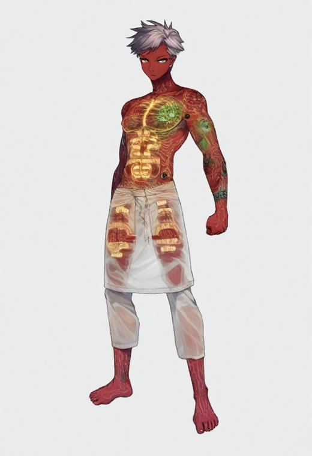 |

### Pony Diffusion V6 XL

```text
1boy, solo, full body, standing, looking at viewer, feet visible, centered composition, white background, middle-aged, lycanthrope, Biotechnology Tattoo Artist, Can absorb emotions as colors and animate tattoos, source_anime, score_9, score_8_up, score_7_up, A middle-aged lycanthrope artist whose living tattoos connect people through visible emotions.
```

除外語:

```text
low quality, blurry, bad anatomy, bad hands, extra fingers, cropped, duplicate, text, watermark, signature
```

| seed 101 | seed 202 |
|---|---|
| 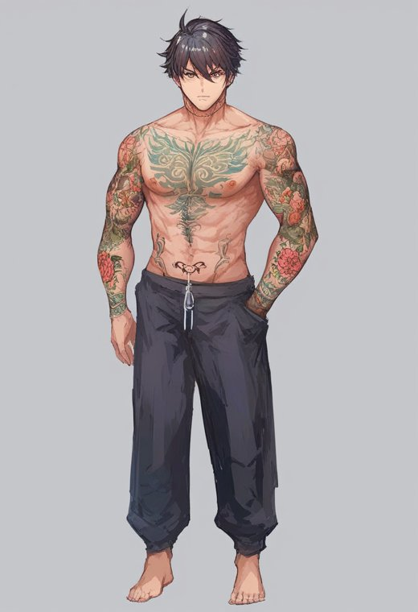 | 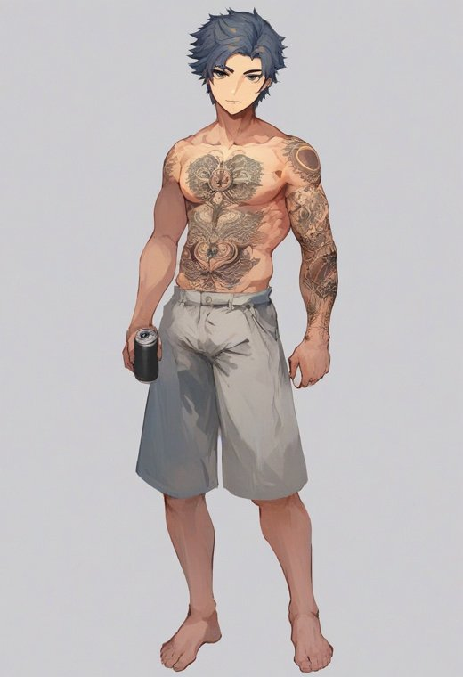 |

### NoobAI XL 1.1

```text
1boy, solo, full body, standing, looking at viewer, feet visible, centered composition, white background, middle-aged, lycanthrope, Biotechnology Tattoo Artist, Can absorb emotions as colors and animate tattoos, masterpiece, best quality, highly detailed, A middle-aged lycanthrope artist whose living tattoos connect people through visible emotions.
```

除外語:

```text
low quality, blurry, bad anatomy, bad hands, extra fingers, cropped, duplicate, text, watermark, signature
```

| seed 101 | seed 202 |
|---|---|
| 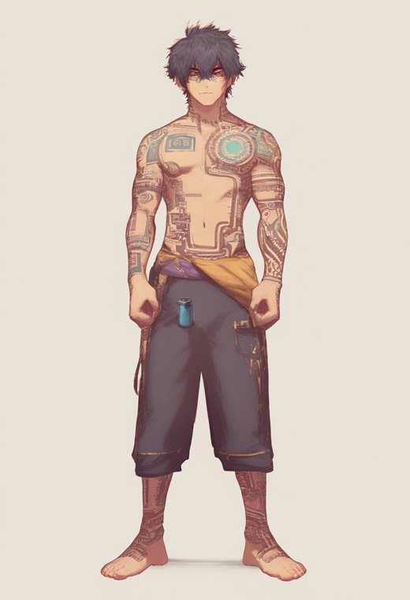 | 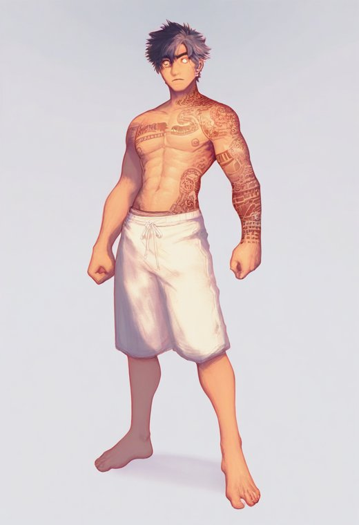 |

### Qwen-Image 2.1

```text
A middle-aged male lycanthrope character whose role is Biotechnology Tattoo Artist and whose ability is Can absorb emotions as colors and animate tattoos. The character is based on the concept: A middle-aged lycanthrope artist whose living tattoos connect people through visible emotions.. Full body, single character, plain white background, anime illustration style, no text or watermark.
```

除外語:

```text
（なし）
```

| seed 101 | seed 202 |
|---|---|
| 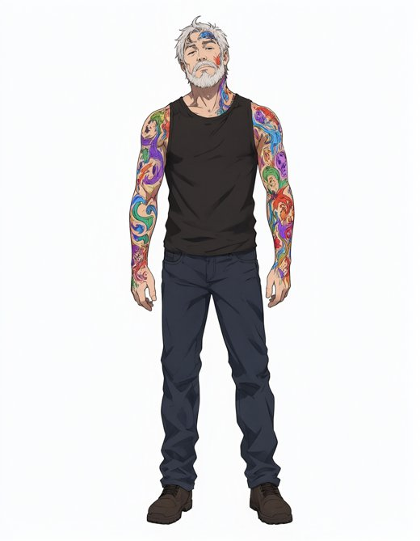 | 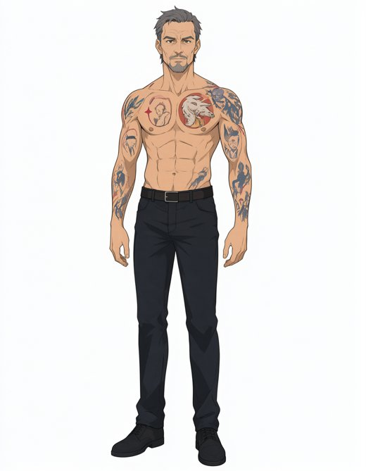 |

全プロンプトと生成条件は [report.json](report.json) にあります。
